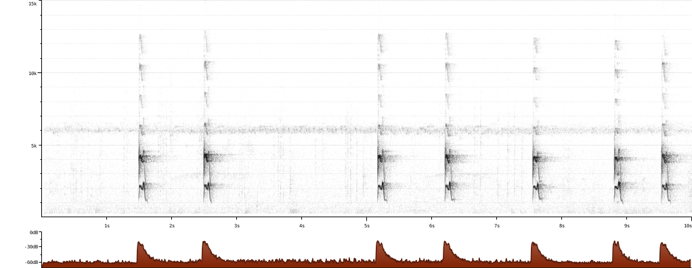

# Chiroxiphia caudata voice

### You may also call me  
Spanish (Argentine): Bailarín azul  
Spanish (Paraguay): Bailarín azul  
Guarani: Saraki hovy  
Portuguese: canto-de-macaco, Dançador, dançarino, fandangueiro, pavãozinho, tangará, Tangara-dançarino, tangará-dançarino, ticolão  
Portuguese (Brazil): canto-de-macaco, dançador, dançarino, fandangueiro, pavãozinho, tangara, Tangará, tangará-dançarino, ticolão  
English: Blue Manakin, Swallow tailed Manakin, Swallow-tailed Manakin  
